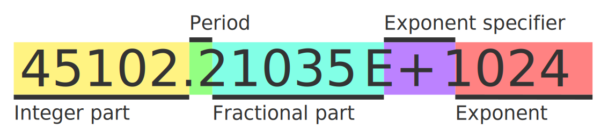

# Mathex Specification v0.1

## Table of Contents

- [Introduction](#introduction)
- [Definitions and Terminology](#definitions-and-terminology)
  - [Expression](#expression)
  - [Identifier](#identifier)
  - [Operator](#operator)
  - [Operand](#operand)
  - [Variable](#variable)
  - [Number](#number)
- [Feature Set](#feature-set)
  - [Implicit Parentheses](#implicit-parentheses)
  - [Scientific Notation](#scientific-notation)
- [Expression Syntax](#expression-syntax)
  - [Number Syntax](#number-syntax)
- [Error Handling](#error-handling)

## Introduction

Mathex is a specification for evaluating mathematical expressions from user input strings. The goal of Mathex is to provide a consistent, easy-to-use, and safe way to evaluate mathematical expressions regardless of programming language.

## Definitions and Terminology

### Expression

Expression is a combination of numbers, variables, and operations that can be evaluated to produce a numerical result.

### Identifier

Identifier is a word or collocation containing only latin letters, digits or underscores, but doesn't start with a digit. They are used as names for user-defined variables and functions.

### Operator

Operator is a symbol or function used to perform a mathematical operation on one or more operands.

- Binary operator is a symbol that takes two operands on both sides and produces one numerical value.
- Unary operator is a symbol that takes one operand from either side and produces one numerical value.
- Function is an identifier followed by a parenthesized list of arguments separated with comma and produces one numerical value.

### Operand

Operand is a number, variable, or parenthesized expression that is operated on by an operator.

### Variable

Variable is an identifier that has constant predefined value. Value of a variable should not be reevaluated each time it is used; for this purpose a zero argument function should be used for explicitness.

### Number

Number is positive decimal floating point number.

## Feature Set

Library implementing this specification must include these features:

- Basic arithmetic operations, including addition, subtraction, multiplication, and division.
- Support for parentheses to specify order of operations.
- Support for variables, which can be defined a value by the user of the library and be used in expressions.
- Support for functions, which can be defined by the user of the library using validator and operator functions and be used in expressions.

### Implicit Parentheses

Implicit parentheses is a quality of life feature that implicitly adds missing parentheses if one or more are missing. If there is not enough closing or opening parentheses, evaluation algorithm should treat the expression as if they were at the very start or end of the expression.

That means expression `"5 + 5) * 2"` should be treated as if there was an opening parenthesis at the beginning and expression `"2 * (3 / (5 - 2"` should be treated as is there were two closing parentheses at the end.

This feature is recommended to have an option to disable, if user of the library doesn't want it for whatever reason.

### Scientific Notation

Scientific notation is a feature that allows users to enter a number in scientific notation. It is written in form of mantissa and exponent separated with an E letter. More details on this in syntax section.

This feature is recommended to have an option to disable, if user of the library doesn't want it for whatever reason.

## Expression Syntax

The syntax for mathematical expressions in Mathex follows standard mathematical notation. The syntax rules are as follows:

1. Binary operators must always by surrounded with operands.
2. Unary operators must always have an operand on appropriate side.
3. Operands should never stay side by side without a non unary operator or comma between them.
4. Arguments inside function parentheses should be valid expressions.
5. Comma is only allowed inside of function parentheses.
6. Non-ASCII characters are not allowed.

### Number Syntax

Valid number syntax consists of five parts:

A number should always contain either an integer part, a fractional part, or both. If either integer part or fractional part is absent, it is considered to be 0. Period is optional, unless fractional part is present.

Exponent specifier is optional, unless exponent is present. Sign in the exponent specifier is optional and can be `+` or `-`.

Integer part, fractional part and exponent are sequences of ASCII digits. Letter E in exponent specifier is not case sensitive.

Presence of exponent specifier and exponent are considered syntax error if scientific notation feature is disabled.

## Error Handling

In case of an error during evaluation it is not recommended to throw an exception or language equivalent, since invalid input is not an exceptional case. Instead, library should return an error code or appropriate alternative.

Here are the kinds of errors that can occur during evaluation:

- Invalid syntax.
- Undefined identifier.
- Incorrect number of arguments for a function call.
- Invalid argument(s) for a function call.
- Division by zero.
- Value is overflowing representation range.
