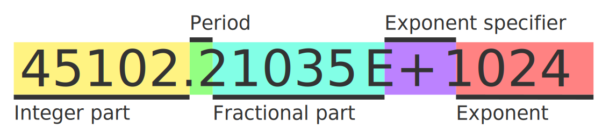

# Mathex Specification v1.0

- [Mathex Specification v1.0](#mathex-specification-v10)
  - [Introduction](#introduction)
  - [Definitions and Terminology](#definitions-and-terminology)
    - [Expression](#expression)
    - [Identifier](#identifier)
    - [Operator](#operator)
    - [Operand](#operand)
    - [Function](#function)
    - [Variable](#variable)
    - [Number](#number)
  - [Feature Set](#feature-set)
    - [Implicit Parentheses](#implicit-parentheses)
    - [Implicit Multiplication](#implicit-multiplication)
    - [Scientific Notation](#scientific-notation)
  - [Expression Syntax](#expression-syntax)
    - [Number Syntax](#number-syntax)
  - [Error Handling](#error-handling)

## Introduction

Mathex is a specification for evaluating mathematical expressions from strings at runtime. The goal of Mathex is to provide a consistent, easy-to-use, and safe way to evaluate mathematical expressions regardless of programming language.

## Definitions and Terminology

### Expression

Expression is a combination of numbers, variables, function calls, and operators that can be evaluated to produce a numerical result.

### Identifier

Identifier is a word or collocation containing only latin letters, digits or underscores, but doesn't start with a digit. They are used as names for user-defined variables and functions.

Each identifier is associated with one variable or function only, but one variable or function can have multiple identifiers for use as aliases.

### Operator

Operator is predefined symbol that is used to perform an operation on one or two operands. Operator can either be binary or unary if it has two or one operands respectively.

- Binary operator takes two operands on both sides and produces one numerical value.
- Unary operator takes one operand from either side and produces one numerical value.

Operators have precendence and associativity. Operators with higher precendence take priority. If two operators have same precedence, they are evaluated in order of associativity.

### Operand

Operand is a number, variable, or parenthesized expression that is operated on by an operator.

### Function

Function is an identifier followed by a parenthesized list of parameters separated with commas. Functions can take zero or more parameters. Parameter of the function can be a number, variable, or expression. Operation performed by a function is defined by user.

Any error returned by user-defined function has to be propagated and returned as an error.

All functions should take any number of arguments. A user-defined function has to know what number of arguments was provided and what are their values. If user decides that the number of arguments provided is incorrect, the user can return an appropriate error.

### Variable

Variable is an identifier that has user-defined value. Value of a variable should not be reevaluated each time it is used; for this purpose a zero argument function should be used for explicitness.

It is recommended to implement two types of variables: Constant and variable.

- Constant variables cannot change their value after definition, unless manually removed and added back.
- Regular variables, on the other hand, can be easily modified by a user, but not during evaluation.

### Number

Number is a positive decimal floating point number literal.

## Feature Set

Library implementing this specification must include these features:

- Basic arithmetic operators, including addition, subtraction, multiplication, and division.
- Additional operators, such as exponentiation and modulus. (recommended to be turned off by default)
- Support for parentheses to specify order of operations.
- Support for variables, which can be defined a value by the user of the library and be used in expressions.
- Support for functions, which can be defined a behaviour by the user of the library and be used in expressions.
- Implicit parentheses.
- Implicit multiplication.
- Scientific notation.

### Implicit Parentheses

Implicit parentheses is a quality of life feature that implicitly assumes missing parentheses if one or more are missing. If there is not enough closing or opening parentheses, evaluation algorithm should treat the expression as if they were at the very start or end of the expression.

That means expression `"5 + 5) * 2"` should be treated as if there was an opening parenthesis at the beginning and expression `"2 * (3 / (5 - 2"` should be treated as if there were two closing parentheses at the end.

This feature is recommended to have an option to disable, if user of the library doesn't want it for whatever reason.

### Implicit Multiplication

Implicit multiplication is a quality of life feature that implicitly assumes multiplication operator between adjacent number literal and identifier. (in that order)

In case of ambiguity between scientific notation and implicit multiplication, case that does not cause an invalid syntax should be chosen. If both cases do not, then scientific notation has to take priority.

If multiplication operator is disabled by a user, implicit multiplication is as well.

This feature is recommended to have an option to disable, if user of the library doesn't want it for whatever reason.

### Scientific Notation

Scientific notation is a feature that allows users to enter a number in scientific notation. It is written in form of mantissa and exponent separated with an E letter. More details on this in [number syntax section](#number-syntax).

This feature is recommended to have an option to disable, if user of the library doesn't want it for whatever reason.

## Expression Syntax

The syntax for mathematical expressions in Mathex follows standard mathematical notation. The syntax rules are as follows:

1. Binary operators must always by surrounded with operands.
2. Unary operators must always have an operand on appropriate side.
3. Operands should never stay side by side without a binary operator (or comma, if inside function parentheses) between them.
4. Arguments inside function parentheses should be valid expressions.
5. Comma is only allowed inside of function parentheses.
6. Non-ASCII characters are not allowed.
7. Spaces are skipped during evaluation.

### Number Syntax

Valid number syntax consists of five parts:

A number should always contain either an integer part, a fractional part, or both. If either integer part or fractional part is absent, it is considered to be 0. Period is optional, unless fractional part is present. Exponent specifier is optional, unless exponent is present.

Integer part, fractional part and exponent are sequences of ASCII digits. Letter E in exponent specifier is not case sensitive. Sign in the exponent specifier is optional and can be `+` or `-`.

Presence of exponent specifier and exponent are considered syntax error if scientific notation feature is disabled.

## Error Handling

In case of an error during evaluation it is not recommended to throw an exception or language equivalent, since invalid input is not an exceptional case. Instead, library should return error as value, e.g. error code or appropriate alternative.

Here are the kinds of errors that can occur during evaluation:

- Invalid syntax.
- Undefined identifier.
- Incorrect number of arguments for a function call.
- Invalid argument(s) for a function call.
- Division by zero.

For languages with manual memory management it is also recommended to have an error for when out of memory. Throwing exception in that case is also exceptable, but terminating a program is not, since the library has to give a user chance to recover or fail gracefully.
